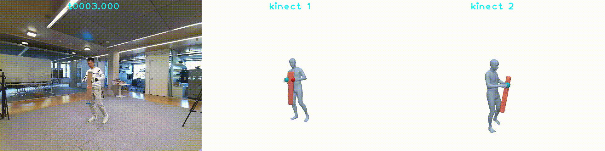

# BEHAVE-dataset
This repo provides sample code to access the BEHAVE dataset.

### Contents
1. [Dependencies](#dependencies)
2. [Dataset Structure](#dataset-structure)
3. [Example usage](#example-usage)

### Dependencies
This repo relies on these external libraries:
1. psbody mesh library. See [installation](https://github.com/MPI-IS/mesh#installation). 
2. trimesh. `pip install trimesh`
3. igl. `conda install -c conda-forge igl`
4. pytorch3d. See [installation](https://github.com/facebookresearch/pytorch3d/blob/main/INSTALL.md).


### Dataset Structure
After unzip the dataset, you can find three subfolders: `calibs`, `objects`, `sequences`. The summary of each folder is described below:
```
calibs: Kinect camera intrinsics and extrinsics for different locations
objects: 3D scans of the 20 objects
sequences: color, depth paired with SMPL and object fits of human-object interaction sequences
```
We discuss details of each folder next:

**calibs**
```
DATASET_PATH
|--calibs           # Kinect camera intrinsics and extrinsics for different locations
|----Date[xx]       # background and camera poses for the scene in this date
|------background   # background image and point cloud 
|------config       # camera poses
|---intrinsics      # intrinsics of 4 kinect camera
```

**objects**
```
DATASET_PATH
|--objects
|----object_name
|------object_name.jpg  # one photo of the object
|------object_name.obj  # reconstructed 3D scan of the object
|------object_name.obj.mtl  # mesh material property
|------object_name_tex.jpg  # mesh texture
|------object_name_fxxx.ply  # simplified object mesh 
```

**sequences**
```
DATASET_PATH
|--sequences
|----sequence_name
|------info.json  # a file storing the calibration information for the sequence
|------t*.000     # one frame folder
|--------k[0-3].color.jpg           # color images of the frame
|--------k[0-3].depth.png           # depth images 
|--------k[0-3].person_mask.jpg     # human masks
|--------k[0-3].obj_rend_mask.jpg   # object masks
|--------k[0-3].color.json          # openpose detections
|--------k[0-3].mocap.[json|ply]    # FrankMocap estimated pose and mesh
|--------person
|----------person.ply               # segmented person point cloud
|----------fit02                    # registered SMPL mesh and parameters
|--------object_name
|----------object_name.ply          # segmented object point cloud
|----------fit01                    # object registrations
```

### Example usage
Here we describe how to generate contact labels from our released data and render one sequence. 

**Generate contact labels**
We provide sample code in `compute_contacts.py` to generate contact labels from SMPL and object registrations. Run with:
```
python compute_contacts.py -s BEHAVE_PATH/sequences/TARGET_SEQ 
```
It samples 10k points on the object surface and compute binary contact label, and the correspondence SMPL vertices for each point. The result is saved as an `npz` file in the same folder of object registration results. 

**Render registrations**

We provide example code in `behave_demo.py` that shows how to access different annotations provided in our dataset. It also renders the SMPL and object registration of a given sequence. Once you have the dataset and dependencies ready, run:
```
python behave_demo.py -s BEHAVE_PATH/sequences/Date04_Sub05_boxlong -v YOUR_VISUALIZE_PATH -vc 
```
you should be able to see this video inside `YOUR_VISUALIZE_PATH`:
<p align="center">

</p>


### Licenses

### Citation
If you use our code or data, please cite:
```
@inproceedings{behave,
    title = {BEHAVE: Dataset and Method for Tracking Human Object Interactions},
    author={Bhatnagar, Bharat Lal and Xie, Xianghui and Petrov, Ilya and Sminchisescu, Cristian and Theobalt, Christian and Pons-Moll, Gerard},
    booktitle = {{IEEE} Conference on Computer Vision and Pattern Recognition (CVPR)},
    month = {jun},
    organization = {{IEEE}},
    year = {2022},
}
```
